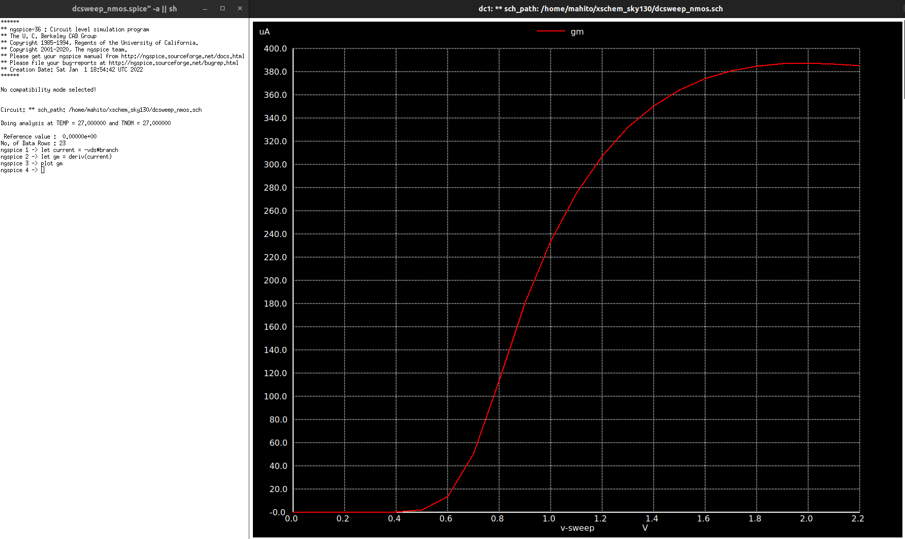

# Cmos-Inverter-with-Sky130pdk
---
## Introduction
This is my first personal project using Sky130 for the purpose to research about MOSFET, CMOS Inverter.Hopefully if you have any question just mail to me "tanlocnguyen2410@gmail.com"
---
## Parts of project
- [1. Tool and PDK Setup](#1-Tools-and-PDK-Setup)
  - [1.1 Tools Setup](#11-Tools-setup)
  - [1.2 PDK Setup](#12-PDK-setup)
- [2. MOSFET Models](#2-MOSFET-Models)
  - [2.1 Basic Parameters](#21-Basic-parameters)
  - [2.2 Characteristics of NMOS and PMOS](#22-Characteristics-of-NMOS-and-PMOS)
- [3. CMOS Characteristic](#3-CMOS-Characteristic)
  - [3.1 Undefined Region](#31-Undefined-Region)
  - [3.2 Performance(Propagation Delay)](#32-Propagation-Delay)
  - [3.3 Adjust performance](#33-Adjust-performance)
---
## 1. Tools and PDK Setup
### 1.1 Tools setup
For the design and simulation of our Inverter.
- Spice netlist simulation - [Ngspice](http://ngspice.sourceforge.net/)
- Layout Design and DRC - [Magic](http://opencircuitdesign.com/magic/)
- LVS - [Netgen](http://opencircuitdesign.com/netgen/)
- Schematic Capture - [Xschem](http://repo.hu/projects/xschem/)

### 1.2 PDK setup
The PDK we are going to use for this BGR is Google Skywater-130 (130 nm) PDK.


**Steps to download PDK** - Open the terminal and type the following to download sky130 PDK.
```
$  git clone https://github.com/RTimothyEdwards/open_pdks.git
$  cd open_pdks
$  ./configure [options]
$  make
$  [sudo] make install
```
**You should follow the instructions given at [this](http://opencircuitdesign.com/open_pdks/index.html) link**
---
## 2. MOSFET Models

 ### 2.1 Basic parameters
 
In this part I going to find Vth(threshold), gm(Transconductance parameter), rds(Linear resistor) by plot Ids vs Vds and Ids vs Vgs with NMOS_1V8 circuit below:


In reality, the turn-on phenomenon is a gradual function of the gate voltage, making it difficult to define VTH unambiguously. In semiconductor physics, the VTH of an NFET is usually defined as the gate voltage for which the interface is “as much n-type as the substrate is p-type.” It can be proved that 

<div align="center">

</div>

Then you must see the plot below you, if you did a DC sweep on the VGS source for different values of VDS:


In short, as you can see in the figure above I found the Vth approximately equal to 700mV - 800mV, so if I keep Vds constant at 1.8V and vary Vgs the formula of Ids if(Vds >= Vgs - Vth), which means MOSFET is in Saturation.

<div align="center">

</div>

So I could easily find the constant μn/Cox = 174μA/V^2 of MOSFET

And another figure to show DC sweep on the VDS source for different values of VGS:


One thing I want to add and you already known it , that Ig is always equal to 0 because in the MOSFET has a dielectric layer as know as Oxide(Si02), it seperate G terminal and the other 3 terminals

<div align="center">

</div>

The figure below will show us in more detail.


After finding Vth, gm(Transconductance parameter) and rds(Linear resistor) take me a quite time :), so this is what I can conclude. As we know that Transconductance (gm) is defined as the ratio between the change in output current and the corresponding change in the input voltage of a MOSFET.

<div align="center">

</div>
So this quite easy to find gm, I already have Ids(current output) and Vds(voltage input) so just using deriv() function, keep Vds constant at 1.8V and vary Vgs.


The figure above show us Ids from 0 - 2.2V, the current Ids at 1.8V equal to 320uA

The way to find gm(Transconductance parameter) and rds(Linear resistor) as follow



Similarly for PMOS the figure below is Ids/Vgs


As you can see at 1.8V the current just equal to 200uA, so I adjust ratio (W/L) of PMOS (4 times the ratio of NMOS) to increase Id upto approximately 320uA like the same what I did to NMOS and here is the result, ofcourse the Vth was changed as well


 ### 2.2 Characteristics of NMOS and PMOS
Before we start to analysis CMOS Inverter, we must know why people merge NMOS and PMOS together to create it.And these are two arguments that we often encounter.c
<ins>NMOS(Strong 0 and Weak 1)</ins></br>
<ins>PMOS(Strong 1 and Weak 0)</ins></br>
Let begin with NMOS first.


As you can see the figure above when the Input is logic 0, the Output voltage is HIGH and opposite to when the Input is logic 1, the Output voltage is not enough HIGH because Vs is not allowed to exceed (Vdd - Vth) that will make NMOS turn off, so inferred NMOS is Strong 0 and Weak 1

Simiraly with PMOS when the Input is high ,Vgs = 0 greater than Vth(-0.65V) so PMOS is turn off and Vout equal to 0, but when the input is LOW Vgs = -1.8V is smaller than Vth(-0.65) so the PMOS is turn on but Vout just only reach to 0.6V approximately to Vth.


Through the above two concepts we can conclude that PMOS is strong "1" and NMOS is strong "0" suitable for creating CMOS Inverter

## 3. CMOS Characteristic
 
 
 ### 3.1 Undefined Region
 
 

The region between VIH and VIL is called the undefined region (sometimes also referred to as transition width, or TW). Steady-state signals should avoid this region if proper circuit operation is to be ensured.

Thence inferred, VIH approximately equals to 0.75V and VIL approximately equals 0.98V </br>
</br>
Another point of interest of the VTC is the gate or switching threshold voltage VM(the intersection between Vout and Vin),which is obtained when the output of a gate is short-circuited to the input and be sure you not confused with Vth of the MOSFET !!!

 

 ### 3.2 Propagation Delay
The propagation delay tp of a gate defines how quickly it responds to a change at its input(s). It expresses the delay experienced by a signal when passing through a gate.It is measured between the 50% transition points of the input and output waveforms</br>
<div align="center">

</div>
And be careful while you calculate that Tphl and Tplh is different because the structure of NMOS and PMOS is different as well if you following this report. So let start to calculate Tphl and Tplh.

<div align="center">

</div>

 

  
  
  
So after we have those 2 quantities are there, just easily to find tp based on the formula of tp,equal to 30.27ps.

<div align="center">

</div>

 ### 3.3 Adjust performance
 As you know that "tr"(the time rise) is independent on Vin, so let find it when our CMOS have no load at Vout.
 
<div align="center">

</div>
I will increase the width of the NMOS and PMOS to see the difference.Let's see whether "tr" increases or decreases ?.
<div align="center">

</div>
Hmmm well it does change, but the change is quite small :) because at here we have no capacitor load so we do not see the difference clearly. So I going to put 1 capacitor at output.Let's see if there's any difference this time.
